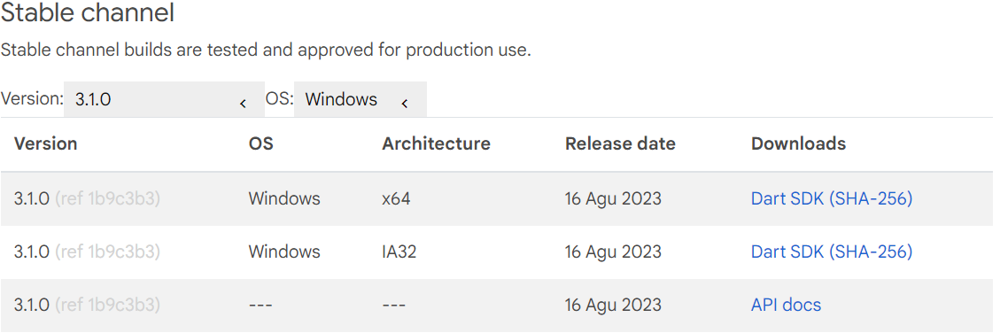
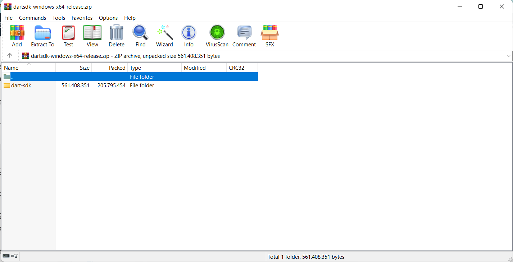
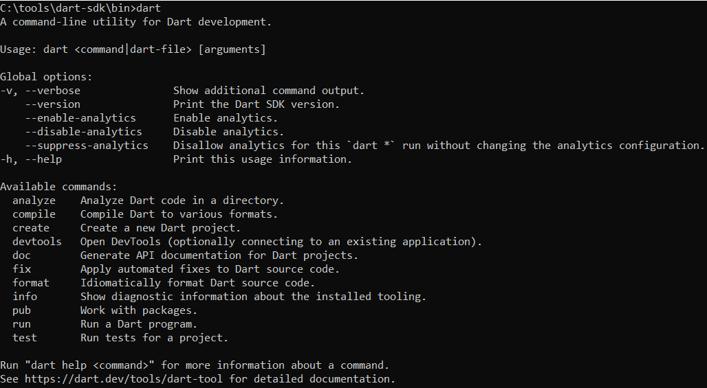
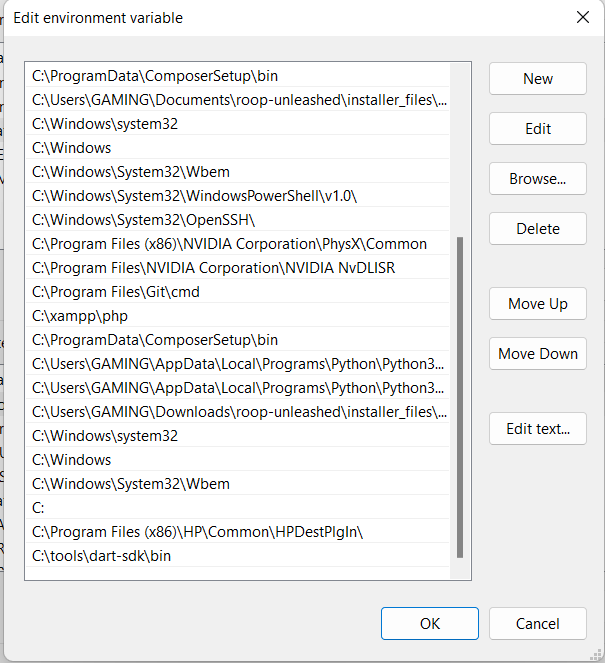
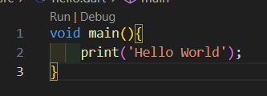
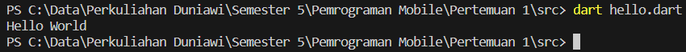

# Pemrograman Mobil - Pertemuan 1


```
Nama            : Roziq Mahbubi
NIM             : 2141720086
```
<b>Langkah-langkah Instalasi Dart</b>
1. Download Dart SDK untuk Windows.
   
2. Extract Dart SDK pada directory yang diinginkan.
   
3. Buka folder **bin** pada folder **dart-sdk**, lalu jalankan cmd
4. Jalankan syntax 'dart' untuk melakukan instalasi dart pada PC.
   
5. Buat path batu untuk dart pada Environment Variables agar dart dapat dijalankan pada seluruh directory pada PC.
   

<b>Screenshot Hello Word</b>
- kode
  
- output
  