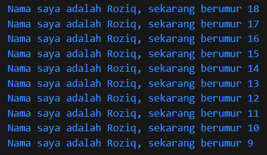

# Pemrograman Mobile - Pertemuan 2
```
Nama            : Roziq Mahbubi
NIM             : 2141720086
```
### Soal
1. Output Program :
   
   <br>
2. Karena bahasa pemrograman yang digunakan oleh framework flutter adalah dart. Sehingga, sangat penting untuk terlebih dahulu mempelajari syntax-syntax dan karakteristik dari bahasa pemrograman dart sebelum mulai menggunakan framework flutter. Karena pada dasarnya sebuah framework merupakan kumpulan-kumpulan syntax dari sebuah bahasa pemrograman yang dibuat dengan tujuan untuk memudahkan pengembangan perangkat lunak.
   <br>
3. 
   - Dart memiliki beberapa fitur yang berguna, diantaranya yaitu :
      - Productive Tooling : Tools untuk menganalisis kode, plugin IDE, dan ekosistem paket yang besar.
      - Garbage Collector : pengelola memory yang tidak digunakan.
      - Type Annotation : pendaftaran tipe data untuk keamanan dan konsistensi data.
      - Statically Typed : analisis type saat runtime untuk mendeteksi bug.
      - Portability : bahasa flutter dapat dikompilasikan ke berbagai macam device.
   - Operator-operator yang ada pada dart kurang lebih sama dengan operator yang ada pada bahasa pemrograman lainnya, seperti :
     - Operator aritmatika : +, -, *, /, %, ~/ (pembagian dengan pembulatan), -expression (pembalikan nilai)
     - Operator persamaan : ==, !=, >, >=, <, <=
     - Operator logika : &&, ||, ! (negasi ekspresi)
     - Operator increment dan decrement : a++, ++a, a--, --a
   - Pada bahasa dart, diperlukan function main() untuk melakukan eksekusi kode, sama seperti bahasa yang dikembangkan dari bahasa C.
   - Pada bahasa dart, dapat dilakukan concat pada function print dengan menggunakan simbol $ untuk variabel yang diconcat.
   - Pada versi terbaru dart, sebuah variabel hanya bisa bernilai null apabila pada saat deklarasinya ditambahkan simbol ? pada tipe data yang digunakan seperti : <br> String? nama;
   - pendeklarasian variabel menggunakan tipe data primitif adalah opsional, namun tetap disarankan untuk menjaga konsistensi kode dan keamanan program.
<br>
4. [Link to Canva](https://www.canva.com/design/DAFtkGzRPuI/b5VuuDL4Xt-fBlTRSwKFVA/edit?utm_content=DAFtkGzRPuI&utm_campaign=designshare&utm_medium=link2&utm_source=sharebutton)