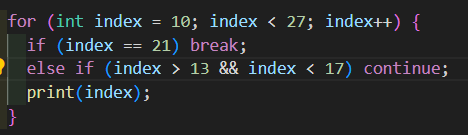

# Pemrograman Mobile - Pertemuan 3
```
Nama            : Roziq Mahbubi
NIM             : 2141720086
```

#### Praktikum 1
- Output : 
  
<br>
- Langkah 1 Menghasilkan :
  <br>
  1. error : terjadi error karena pada keyword if dan else pada baris 4 dan 6 menggunakan huruf kapital yang akan menghasilkan error karena dart merupakan bahasa pemrograman yang case sensitive sehingga perbedaan kapital berkemungkinan menghasilkan error.
  <br>
  <br>
  2. output yang diinginkan : jika error diperbaiki, maka baris kode akan menghasilkan print "Test2"
<br>
<br>
- Langkah 3 menghasilkan : 
  <br>
  1. error : menghasilkan error karena variable yang digunakan pada pengkondisian if bertipe string sehingga menghasilkan error, dan juga dilakukan deklarasi variable baru menggunakan nama variable yang telah ada, sehingga menghasilkan error juga.
  <br>
  <br>
  2. output yang diinginkan : jika error diperbaiki, maka kode akan menghasilkan print berupa string "Kebenaran"

#### Praktikum 2

- Output : 
  
  
<br>
- Langkah 1 menghasilkan :
  <br>
  1. error : menghasilkan error karena variable yang dijadikan pengkondisian while belum dideklarasi dan diinisialisasi, sehingga menghasilkan error.
  <br>
  <br>
  2. output yang diinginkan : apabila error diperbaiki, maka program akan melakukan print untuk nilai awal variable counter, hingga counter bernilai 32, karena terdapat pengkondisian counter < 33.
<br>
<br>
- Langkah 3 menghasilkan :
  <br>
  1. output tanpa error :  kode asli tidak menghasilkan error karena variable counter sudah dideklarasikan dan memiliki sebuah value, yang dilakukan oleh baris kode ini adalah melakukan print untuk nilai counter saat ini lalu melakukan increment pada counter dan melakukan pengecekan kondisi dengan kondisi counter < 77. 

#### Praktikum 3

- Output : 
  
<br>
- Langkah 1 menghasilkan :
<br>
  1. error : terjadi error karena pendeklarasian variable pada dart dibutuhkan tipe data variable secara explisit, dan juga nama variable yang berbeda-beda (Index dan index) juga akan menghasilkan error, dan juga pada penggunaan perulangan for, tidak dilakukan increment pada variable index sehingga perulangan akan memiliki iterasi yang tidak terhingga karena variable index tidak akan pernah mencapai kondisi yang membatasi perulangan.
<br>
<br>
  2. output yang diinginkan : kode yang telah dibenarkan akan melakukan print variable index mulai dari value awal hingga value 26.
<br>
<br>
- Langkah 3 menghasilkan :
<br>
  1. error : menghasilkan error karena keyword yang digunakan menggunakan huruf kapital sehingga tidak dikenali oleh program dan juga variable yang digunakan merupakan variable yang berbeda dengan yang telah dideklarasikan sebelumnya.
<br>
<br>
  2. tidak akan menghasilkan output : penambahan baris kode tersebut digunakan untuk memberikan pemilihan kondisi, apabila index mencapai value 21, maka program akan menghentikan perulangan, namun apabila index memiliki value lebih dari satu atau kurang dari tujuh, maka perulangan akan dilanjutkan pada iterasi berikutnya dan mengabaikan kode dibawah pemilihan kondisi else if, yang berarti bahwa baris kode print(index) tidak akan bisa dijalankan, karena mau berapapun value dari index akan memnuhi kondisi dari else if, sehingga baris kode print(index) akan tetap dilewati.
<br>
<br>
  3. output muncul jika : jika baris kode else if, pada pemilihan kondisi, kondisi yang digunakan diubah, karena variable index dimulai dari 10, sehingga kondisi (index > 1) akan menyebabkan program tidak menghasilkan output dari awal perulangan hingga akhir perulangan.
<br>
<br>
- Perbaikan langkah 3 
<br>
pada kode di bawah, pemilihan kondisi pada <i>else if</i> akan melakukan <i>continue</i> apabila index bernilai lebih dari 13 dan kurang dari 17, yang artinya apabila index bernilai 14 sampai dengan 16, maka program akan melakukan <i>continue</i>.
<br>

 
<br>

 
#### Tugas

- output :
  

#### Switch-Case

Pada bahasa pemrograman dart, apabila pada penggunaan switch-case, jika case yang bernilai true tidak berisi argumen apapun, maka program akan melanjutkan pada case berikutnya hingga program menemui titik koma yang dianggap sebagai break.

