# Pemrograman Mobile - Pertemuan 4
```
Nama            : Roziq Mahbubi
NIM             : 2141720086
```
## Praktikum
#### Praktikum 1
##### Langkah 1
output : 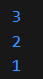

##### Langkah 3
output : 

#### Praktikum 2
##### Langkah 1
output : 

##### Langkah 3
output sebelum diubah : 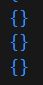
output setelah diubah : 

#### Praktikum 3
##### Langkah 1
output : 

##### Langkah 3
pada kode yang diberikan pada langkah ini, muncul peringatan karena adanya deklarasi list baru bernama mhs1 dan mhs2, namun hingga akhir kode kedua list tersebut tidak pernah digunakan, sehingga dianggap membebani memory.
<br>

kode : 
output : 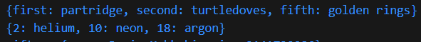

##### Manambahkan data
output : 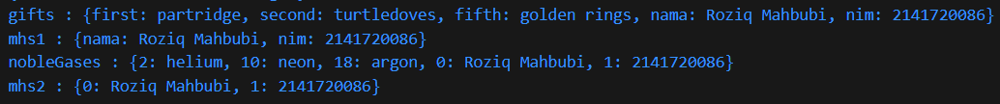

### Praktikum 4
#### Langkah 1
Pada langkah ini, terdapat error pada kode yang diberikan karena kesalahan pada nama variable <i>list</i> yang ada pada saat pemanggilan.
<br>

kode : 
output : 

#### Langkah 3
Pada langkah ini, terjadi error karena dilakukan inisialisasi list baru tanpa deklarasi. Koreksi dari kode ini adalah menambahkan keyword <i>var</i> sebelum nama list baru.
<br>

kode : 
output : 

#### Langkah 4
Kode pada langkah ini error karena variable yang digunakan sebagai pemilihan kondisi belum dideklarasikan. Solusinya adalah mendeklarasikan variable tersebut dan juga menginisialisasikan nilainya.
<br>

kode : 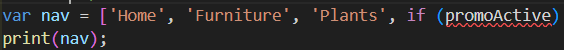
output jika promoActive true : 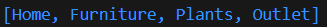
output jika promoActive false : 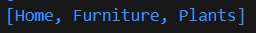

#### Langkah 5
Kode pada langkah ini error karena variable yang digunakan sebagai pemilihan kondisi belum dideklarasikan. Solusinya adalah mendeklarasikan variable tersebut dan juga menginisialisasikan nilainya.
<br>

kode : 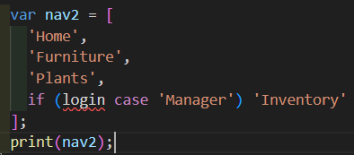
output jika login == 'Manager' : 
output jika login != 'Manager' : 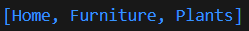

#### Langkah 6
Pada langkah ini, digunakan operator collection for dalam sebuah list. Pada kode kali ini, operator for diguanakan untuk melakukan pengulangan dengan iterasi sesuai dengan jumlah isi dari list <i>listOfInts</i>, lalu menempatkan tiap isi list tersebut ke dalam sebuah string yang akan dijadikan isi dari list lainnya.
<br>

output : 

### Praktikum 5
#### Langkah 1
Pada langkah ini terjadi error karena hilangnya semicolon.
<br>

kode : 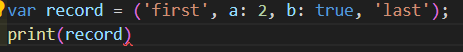
output : 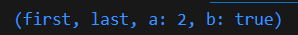

#### Langkah 3
Pada langkah ini tidak terjadi error, hanya saja function tukar() tidak digunakan, sehingga tidak terlihat output yang berbeda. Solusinya adalah dengan menggunakan funstion tukar().
<br>

ouput : 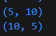

#### Langkah 4
Pada langkah ini, terjadi error karena record mahasiswa belum diinisialisasikan namun sudah diakses. Hal itu terjadi karena record mahasiswa bukanlah nullable variable sehingga sistem mendeteksinya sebagai error. Solusinya adalah melakukan inisialisasi value dari record mahasiswa.
<br>

kode : 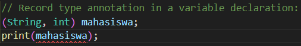
output : 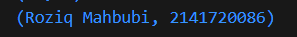

#### Langkah 5
Collection record pada dart, merupakan tipe data yang immutable, yang berarti tipe data record merupakan tipe data yang valuenya tidak bisa diubah setelah diinisialisasikan pertama kali, sehingga perubahan value hanya bisa dilakukan saat inisialisasi pertama kali.
<br>

output sebelum diubah : 
output setelah diubah : 

## Tugas
#### Pertanyaan :
1. Jelaskan yang dimaksud Functions dalam bahasa Dart!
2. Jelaskan jenis-jenis parameter di Functions beserta contoh sintaksnya!
3. Jelaskan maksud Functions sebagai first-class objects beserta contoh sintaknya!
4. Apa itu Anonymous Functions? Jelaskan dan berikan contohnya!
5. Jelaskan perbedaan Lexical scope dan Lexical closures! Berikan contohnya!
6. Jelaskan dengan contoh cara membuat return multiple value di Functions!

#### Jawaban : 
1. Dalam bahasa dart, sebuah function merupakan sekumpulan syntax yang dienkapsulasi menjadi satu dan didaftarkan dengan sebuah nama, tipe data pengembalian, dan parameter(opsional). Nama function digunakan untuk mengakses atau memanggil fucntion. Tipe data kembalian digunakan untuk mendefinisikan tipe data yang diekspektasikan sebagain nilai yang dikembalikan oleh function tersebut. Kemudian parameter merupakan placeholder dari variable yang secara khusus ditempatkan pada function tersebut untuk diolah.
2. Pada dart, terdapat tiga jenis parameter function. Parameter yang pertama adalah parameter wajib, yaitu parameter yang harus dipenuhi ketika pemanggilan function. Kemudian ada prameter opsional, yaitu parameter yang tidak harus dipenuhi untuk memanggil function, parameter ini ditandai dengan kurung siku. Terakhir ada parameter function, yaitu parameter function yang bisa diisi oleh function lainnya.
3. Function sebagai first-class objects apabila function diperlakukan selayaknya sebuah object. Ciri-cirinya adalah function bisa di-assign ke dalam sebuah variable, function tersebut dapat digunakan sebagai sebuah argument oleh function lainnya dan function tersebut dapat digunakan sebagai nilai return.
4. Anonymous function merupakan function yang tidak terikat dengan sebuah pengenal, function jenis ini sering kali diteruskan ke higher-order function sebagai parameter yang digunakan untuk membantu function tersebut mencapai hasil yang diinginkan.<br> Contoh : <br> ``` var halo = function(){ print('Hello World!') }; halo()```<br> Dalam konteks ini, variable halo digunakan sebagai tempat menyimpan anonymous function.
5. Lexical scope merupakan konsep dimana variable dapat diakses oleh kode apapun yang ada di dalam blok kode variable tersebut dideklarasikan, sedangkan lexical closure merupakan konsep dimana sebuah function dapat mengakses variable yang dideklarasikan pada function induknya meskipun function induknya telah selesai dieksekusi. <br> Contoh : <br> - lexical scope : <br> ```function a(){ int a = 5; function b(){ a += 10;}}```, variable a dapat diakses oleh function b karena function b masih berada dalam satu blo yang sama dengan variable a<br> - lexical closure : <br> ```function tambah(int angka) { return (int bilangan) => bilangan + angka}  var tambah10 = tambah(10); print(tambah10(5))```, dalam contoh ini, hasil print adalah '15'. pada saat function tambah mengembalikan sebuah function lain, dan pada deklarasi variable tambah10, function tersebut ditampung dalam variable tersebut.
6. Dalam dart, pengembalian nilai pada function hanya bisa dilakukan dengan data tunggal. Apabila ingin mengembalikan banyak nilai, maka nilai-nilai tersebut perlu untuk dibungkus oleh tipe data yang dapat menampung banyak nilai, seperti list, set, map, record, dan lain sebagainya. <br> contoh : <br> ```List fungsi(){ return list a; }```