# Pemrograman Mobile - Pertemuan 5
```
Nama            : Roziq Mahbubi
NIM             : 2141720086
```

### Langkah Praktikum : 

1. Membuat Project, membuat project flutter pada command prompt dapat dilakukan dengan perintah : 'flutter create nama_project'
2. Mencoba Menjalankan Project
Virtual Machine :
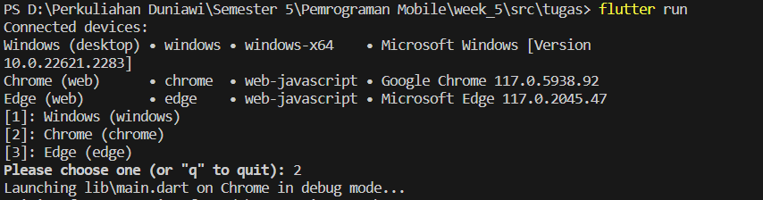
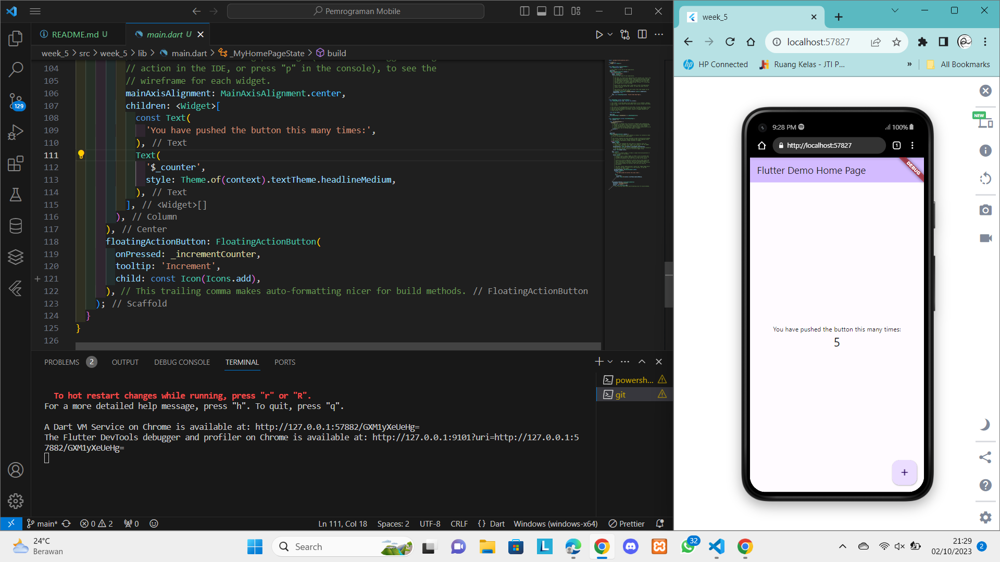
Device :
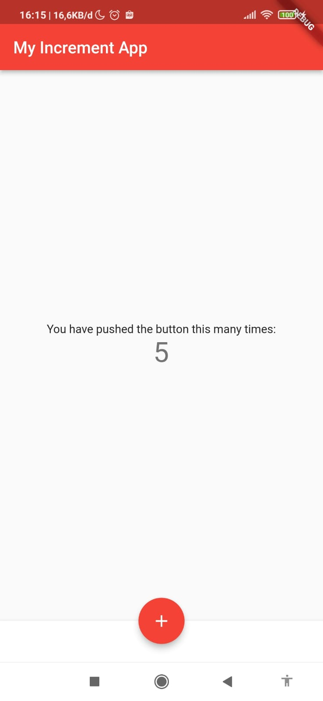
3. Membuat Text Widget
Virtual Machine :
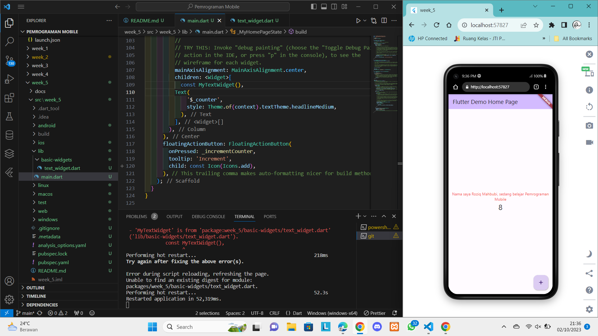
Device :
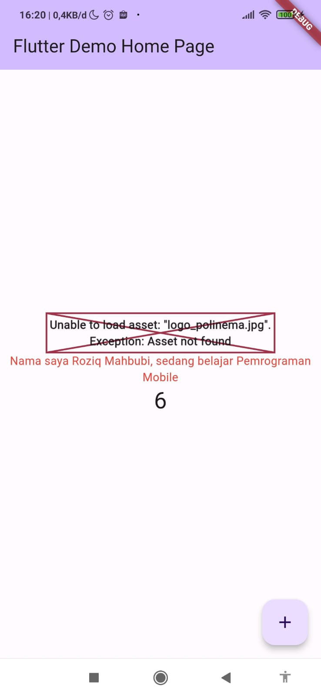
4. Membuat Image Widget
Virtual Machine :
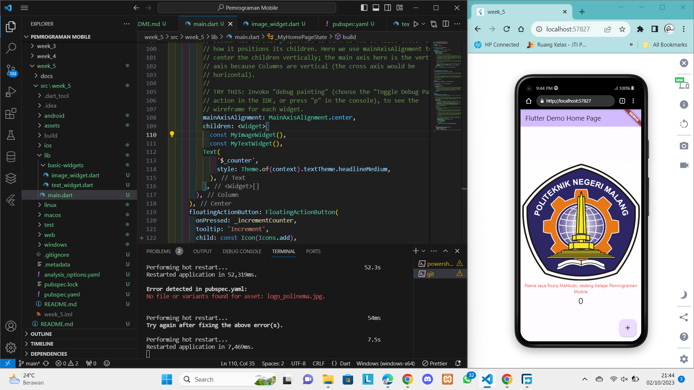
Device :

5. Membuat Dialog Widget
Virtual Machine :
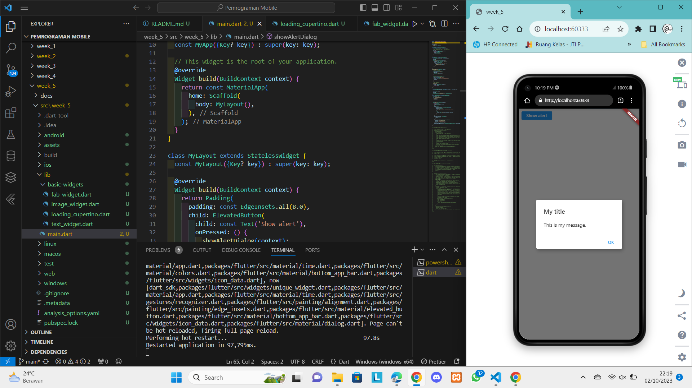
Device :
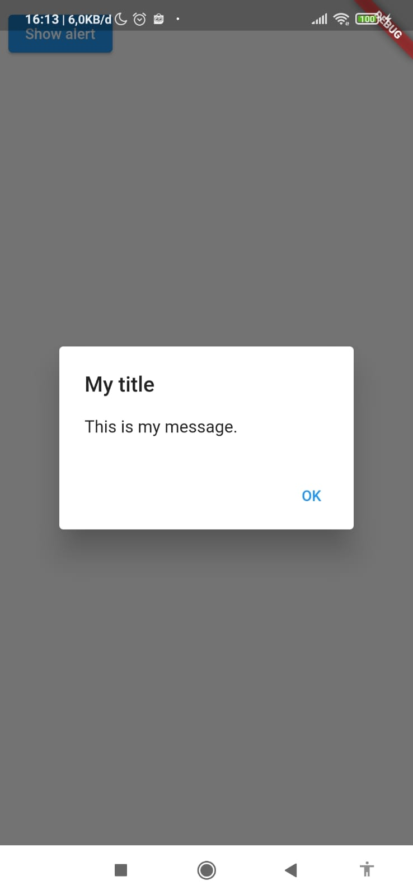
6. Membuat Text Input Widget
Virtual Machine :
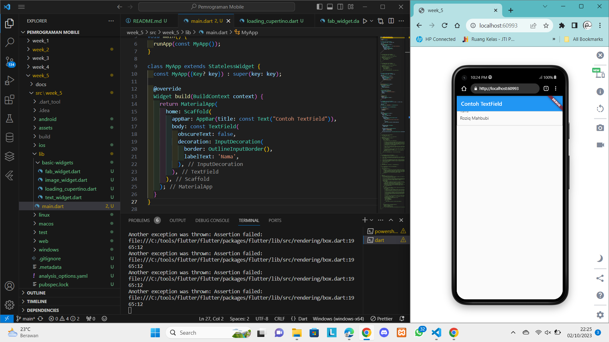
Device :
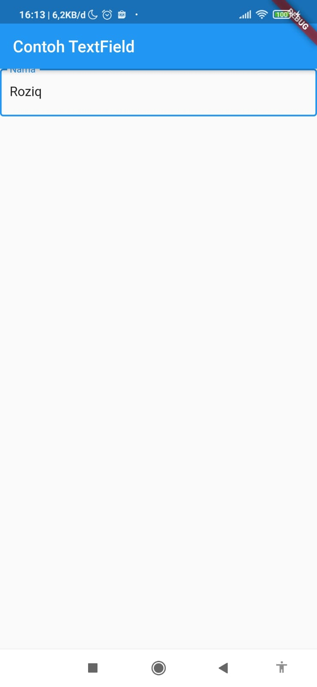
7. Membuat Date Selection Widget
Virtual Machine :
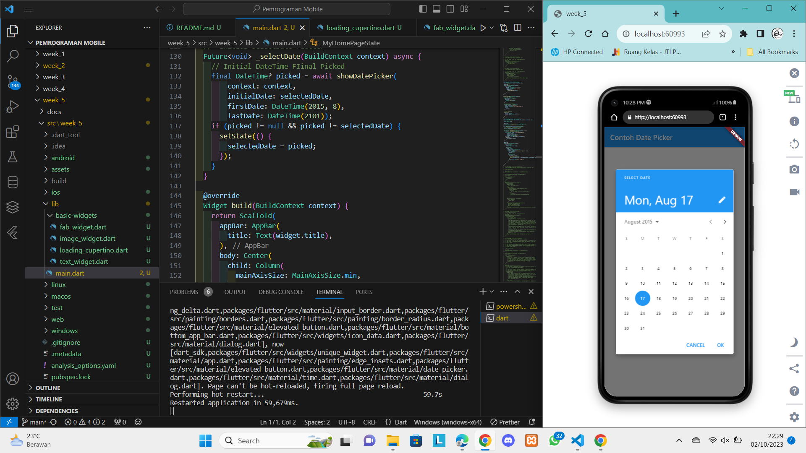
Device :
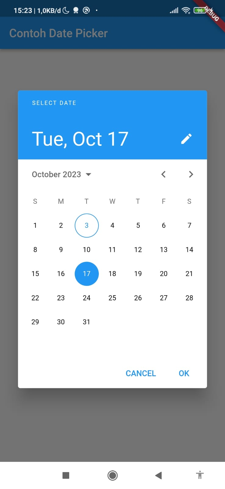
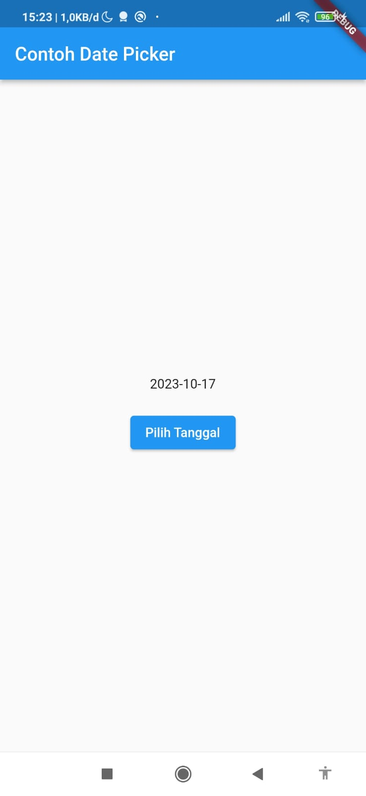

### Hasil Tugas Praktikum :
Virtual Machine :
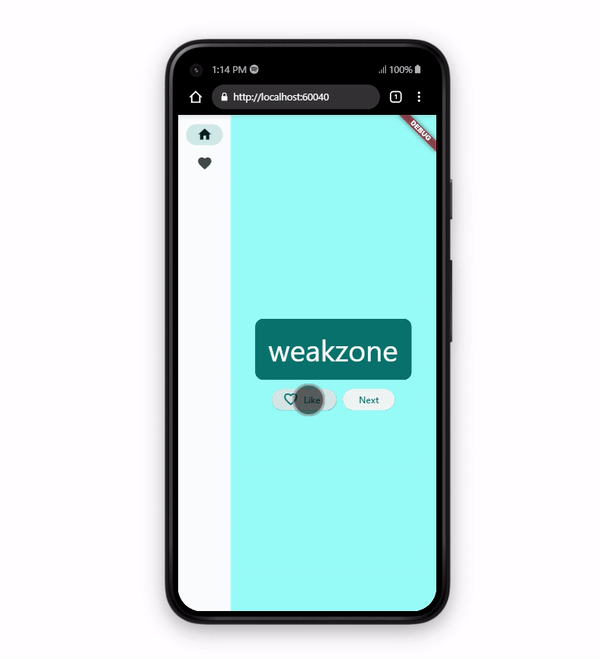
Device :
