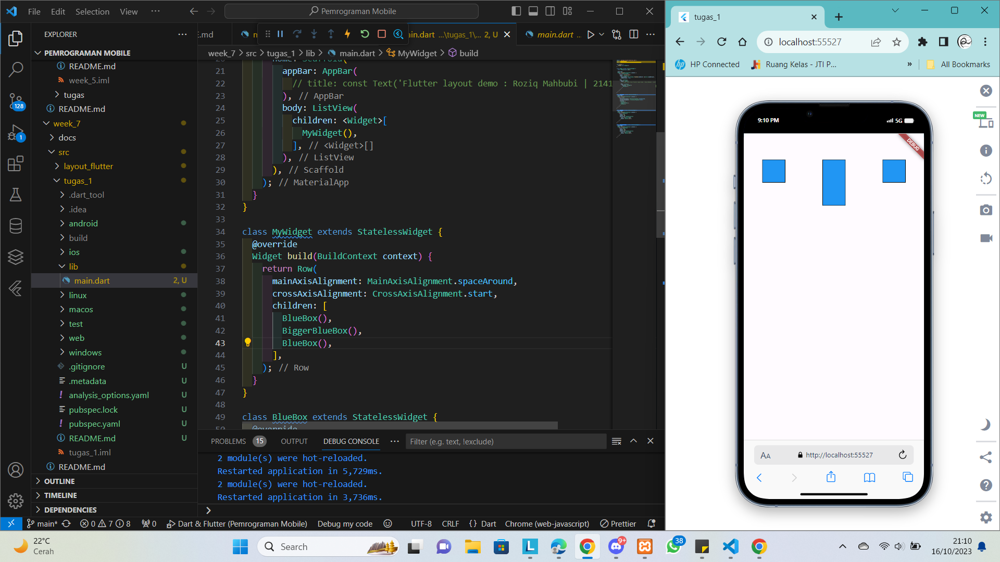
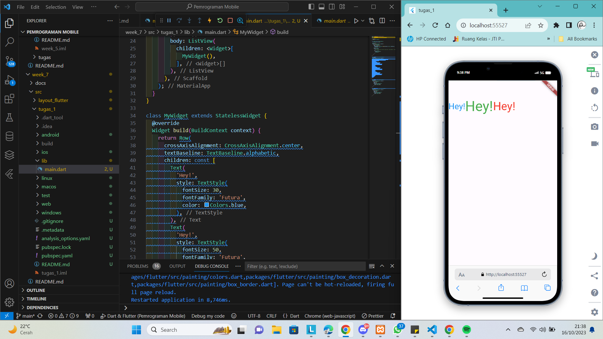

# Pemrograman Mobile - Pertemuan 7
```
Nama            : Roziq Mahbubi
NIM             : 2141720086
```

## Hasil Praktikum
### Praktikum 1

### Praktikum 2

### Praktikum 3

### Praktikum 4


## Tugas 
### Row and Column classes
Column

Row


### mainAxisSize property
Min

Max


### mainAxisAlignment property
End

Start


### crossAxisAlignment property
Start

Center


### Flexible widget
Loose

Tight


### Expanded widget


### SizedBox widget
Width 100

Width 100 Height 100

Space Between 50

Space Between 50 & 25


### Spacer widget
1 Spacer, Flex = 1

2 Spacer, Flex = 1


### Text widget
Center

Baseline


### Icon widget
Icon

Add Icon


### Image widget
Error URI

Image 1

Image 2

Image 3


### Bussiness Card
Memberikan Text

Memberikan Icon

Memberikan Ruang Tambahan(merubah Row menjadi Column)

Memberikan Contact Info
