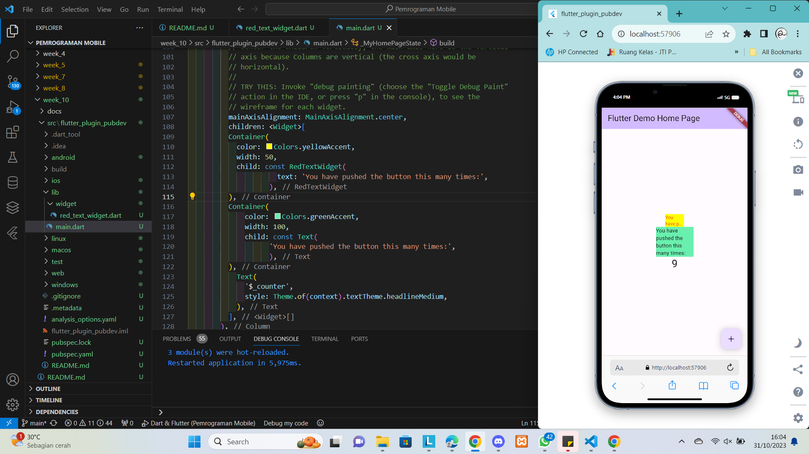

# Pemrograman Mobile - Pertemuan 10
```
Nama        : Roziq Mahbubi
NIM         : 2141720086
```

## Praktikum

### Pertanyaan 
1. 
   Pertanyaan Langkah 4 : 
   Setelah Anda menambahkan kode di atas, Anda akan mendapatkan info error. Mengapa demikian? Jelaskan dalam laporan praktikum Anda! <br>
   Jawaban :
   Error terjadi karena package yang digunakan belum dilakukan import pada package tersebut pada file. <br>

### Output


## Tugas

### Pertanyaan :
1. Selesaikan Praktikum tersebut, lalu dokumentasikan dan push ke repository Anda berupa screenshot hasil pekerjaan beserta penjelasannya di file README.md!
2. Jelaskan maksud dari langkah 2 pada praktikum tersebut!
3. Jelaskan maksud dari langkah 5 pada praktikum tersebut!
4. Pada langkah 6 terdapat dua widget yang ditambahkan, jelaskan fungsi dan perbedaannya!
5. Jelaskan maksud dari tiap parameter yang ada di dalam plugin auto_size_text berdasarkan tautan pada dokumentasi <a href="https://pub.dev/documentation/auto_size_text/latest/"> ini </a> !

### Jawaban
2. Pada langkah dua, dilakukan penambahan package AutoSizeText melalui command line ke dalam dependencies project agar dapat digunakan.
3. Pada langkah lima, ditambahkan sebuat variable bernama text dan juga parameter variable tersebut pada constructor untuk selanjutnya akan digunakan pada widget AutoSizeText yang ada pada function build.
4. Pada widget kedua, dilakukan penampilan text menggunakan widget text biasa, sedangkan pada widget pertama, dilakukan penampilan text menggunakan widget RedTextWidget yang baru saja dibuat. Pada widget tersebut, text ditamplikan menggunakan AutoSizeText yang membatasi penampilan text pada 2 baris saja
5. Penjelasan parameter Package AutoSizeText :
    |Parameter|Penjelasan|
    |-|-|
    |key|Mengontrol bagaimana suatu widget dapat menggantikan widget lainnya dalam hierarki tree|
    |textKey|menetapkan suatu key unik untuk text yang dihasilkan|
    |style*|style dari text pada widget|
    |minFontSize|batas minimum ukuran text|
    |maxFontSize|batas maksimum ukuran text|
    |stepGranularity|jumlah langkah yang digunakan dalam penyesuaian ukuran text|
    |presetFontSizes|mendefinisikan ukuran text yang mungkin|
    |group|melakukan grouping pada text tertentu|
    |textAlign*|alignment dari text|
    |textDirection*|arah text|
    |locale*|digunakan untuk memilih font ketika karakter Unicode yang sama dapat ditampilkan secara berbeda, tergantung pada lokasi.|
    |softWrap*|menentukan apakah text harus diputus pada jeda baris|
    |wrapWords|apakah kata-kata yang tidak muat dalam satu baris harus di wrap|
    |overflow*|bagaimana overflow text ditangani|
    |overflowReplacement|jika text meluap dan tidak muat dalam batasannya, widget ini ditampilkan sebagai gantinya. Ini membantu dalam memberikan alternatif visual ketika text terlalu besar untuk ditampilkan sepenuhnya|
    |textScaleFactor*|Jumlah font pixel untuk setiap logical pixel|
    |maxLines|jumlah maksimum baris pada text|
    |semanticsLabel*|label semantik text|
