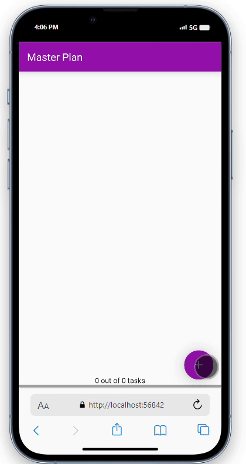

# Pemrograman Mobile - Pertemuan 11
```
Nama        : Roziq Mahbubi
NIM         : 2141720086
```

## Praktikum


### Praktikum 1

#### Output


#### Tugas Praktikum
##### Pertanyaan :
1. Jelaskan maksud dari langkah 4 pada praktikum tersebut! Mengapa dilakukan demikian?
2. Mengapa perlu variabel plan di langkah 6 pada praktikum tersebut? Mengapa dibuat konstanta ?
3. Lakukan capture hasil dari Langkah 9 berupa GIF, kemudian jelaskan apa yang telah Anda buat!
4. Apa kegunaan method pada Langkah 11 dan 13 dalam lifecyle state ?

##### Jawaban : 
1. Pembuatan file data_layer.dart digunakan untuk melakukan export pada dua model yaitu model plan.dart dan task.dart. Hal ini dilakukan dengan tujuan agar hanya melakukan import pada file data_layer.dart saja jika ingin melakukan import pada kedua model tersebut, sehingga import hanya perlu dilakukan sekali saja.
2. Pendeklarasian variable dimaksudkan sebagai variable state yang akan diakses dan dimanipulasi oleh widget-widget lain. Penggunaan kata kunci const karena constructor dari class Plan() memiliki tipe data const.
3. 
   output :
   
   <br>penjelasan :<br>
   Aplikasi sederhana di atas dibuat dengan :<br>
    - menggunakan dua model, yaitu task dan plan yang juga memanfaatkan task. Model task digunakan untuk menyimpan deskripsi dari task tersebut dan status penyelesaiannya. Model plan digunakan sebagai state pada plan_page, yang hanya menyimpan nama plan tersebut dan list task pada plan tersebut.
    - data_layer.dart digunakan sebagai file untuk me-export dua model yang digunakan agar dapat diimport sekali saja.
    - pada plan_screen.dart dilakukan deklarasi plan sebagai variable state yang dapat diakses oleh seluruh widget.
    - pada plan_screen.dart ada beberapa widget yang digunakan untuk membuat tampilan dan memanipulasi state, widget yang pertama adalah buildList yang digunakan untuk membuat listview dari list task yang ada pada state plan, build buildtasktile digunakan untuk menamplikan setiap task pada state plan dan juga untuk memanipulasi atribut dari task tersebut,  dan buildaddtaskbutton digunakan untuk menampilkan tombol untuk menambah jumlah task pada state plan.
4. initState dan dispose berperan dalam memulai dan mengakhiri lifecycle dari sebuah state. initState berisi kode-kode yang akan dijalankan apabila stateful widget yang menggunakan state tersebut dibuat dan dispose akan melekukan pembersihan state apabila stateful widget tersebut dihapus.

### Praktikum 2

#### Output


#### Tugas Praktikum
##### Pertanyaan :
1. Jelaskan mana yang dimaksud InheritedWidget pada langkah 1 tersebut! Mengapa yang digunakan InheritedNotifier?
2. Jelaskan maksud dari method di langkah 3 pada praktikum tersebut! Mengapa dilakukan demikian?
3. Lakukan capture hasil dari Langkah 9 berupa GIF, kemudian jelaskan apa yang telah Anda buat!

##### Jawaban : 
1. Inherited widget pada langkah satu adalah class PlanProvider, dideklarasikan dengan melakukan extend pada class InheritedNotifier dimaksudkan agar PlanProvider dapat melakukan notify pada widget-widget yang menjadi child-nya ketika ada perubahan pada value dari model Plan melalui ValueNotifier.
2. Method :
   * get completedCount : melakukan pengembalian jumlah dari model Task dalam Plan yang memiliki value completed == true
   * get completnessMessage : melakukan pengembalian berupa string yang berisi pesan tantang status penyelesaian keseluruhan Task dalam Plan
3. output :
   
   <br> Hal yang dilakukan pada praktikum 2 : <br>
   - melakukan pembuatan InheritedWidget yang dapat melakukan notify ketika ada perubahan value berupa class PlanProvider yang menagmbil data dari class Plan.
   - merubah cara pengambilan data dari tiap widget di view plan_screen menjadi pengambilan data melalui valueNotifier dari PlanProvider yang diinisiasikas pada main.dart.