# Pemrograman Mobile - Pertemuan 12
```
Nama        : Roziq Mahbubi
NIM         : 2141720086
```

## Praktikum

#### Soal 1
Tambahkan nama panggilan Anda pada title app sebagai identitas hasil pekerjaan Anda.
##### Jawaban :
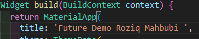

#### Soal 2
* Carilah judul buku favorit Anda di Google Books, lalu ganti ID buku pada variabel path di kode tersebut. Caranya ambil di URL browser Anda seperti gambar berikut ini.
* Kemudian cobalah akses di browser URI tersebut dengan lengkap seperti ini. Jika menampilkan data JSON, maka Anda telah berhasil. Lakukan capture milik Anda dan tulis di README pada laporan praktikum. Lalu lakukan commit dengan pesan "W12: Soal 2".
##### Jawaban :
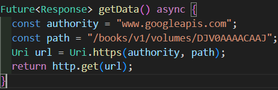
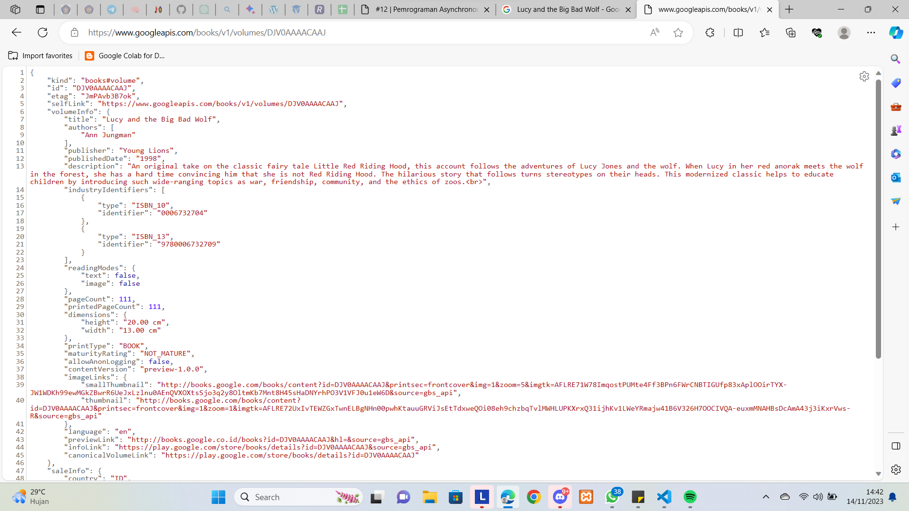

#### Soal 3
* Jelaskan maksud kode langkah 5 tersebut terkait substring dan catchError!
* Capture hasil praktikum Anda berupa GIF dan lampirkan di README. Lalu lakukan commit dengan pesan "W12: Soal 3".
##### Jawaban :
1. pada langkah 5, subString bertujuan untuk merubah value yang didapatkan dari ```value.body.toString()``` menjadi hanya karakter dari value tersebut dimulai dari karakter pada index 0 hingga karakter pada index 450. Sedangkan catchError merupakan error handling yang akan dijalankan apabila pengambilan data dari API gagal.
2. output:<br> 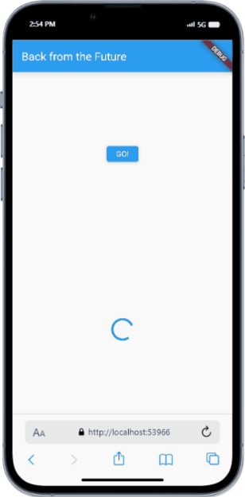
 
#### Soal 4
* Jelaskan maksud kode langkah 1 dan 2 tersebut!
* Capture hasil praktikum Anda berupa GIF dan lampirkan di README. Lalu lakukan commit dengan pesan "W12: Soal 4".
##### Jawaban :
1. * kode pada langkah 1 berisi function yang akan mengembalikan masing-masing nilai 1, 2 dan 3 yang pengembalian nilainya di-delay dengan waktu 3 detik.
   * kode pada langkah 2 adalah method yang digunakan untuk menghitung total dari data kembalian ketiga function sebelumnya, pengambilan nilai dari ketiga function dilakukan satu persatu sehingga waktu tunggu untuk nilai kembalian function count() adalah 9 detik.
2. output : <br> 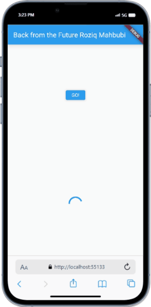
 
#### Soal 5
* Jelaskan maksud kode langkah 2 tersebut!
* Capture hasil praktikum Anda berupa GIF dan lampirkan di README. Lalu lakukan commit dengan pesan "W12: Soal 5".
##### Jawaban :
1. Pada langkah 2 dilakukan :
   * deklarasi variable late sekaligus Completer bernama completer, tipe completer bertujuan agar variable late dapat diisi dengan menggunakan future.
   * inisiasi function ```getNumber()``` yang memberikan tipe kembalian int pada variable completer, memanggil function ```calculate()``` dan mengembalikan value future dari variable completer.
   * inisiasi function ```calculate()``` sebagai function asynchronous dan memiliki delay execution selama 5 detik, dan menyelesaikan variable completer dengan memanggil ```completer.complete(42)```
2. output : <br> 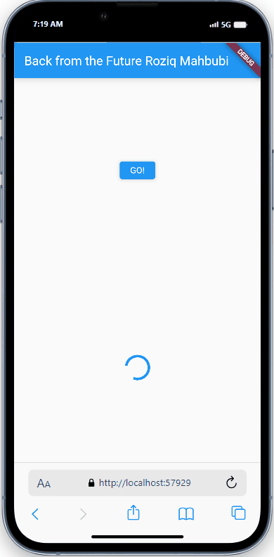
 
#### Soal 6
* Jelaskan maksud perbedaan kode langkah 2 dengan langkah 5-6 tersebut!
* Capture hasil praktikum Anda berupa GIF dan lampirkan di README. Lalu lakukan commit dengan pesan "W12: Soal 6".
##### Jawaban :
1. Perbedaan langkah 2 dan langkah 5-6 adalah pada langkah 5-6 dilakukan error handling dimana jika terjadi error pada proses asynchronous, maka pada tahap ```completer.complete()``` akan dinyatakan sebagai error dan pada tahap ```getNumber().then()``` akan ditambahkan ```catchError``` yang melakukan inisiasi pada variable result sehingga menjadi ```result = 'An error occurred';```.
2. output : <br> 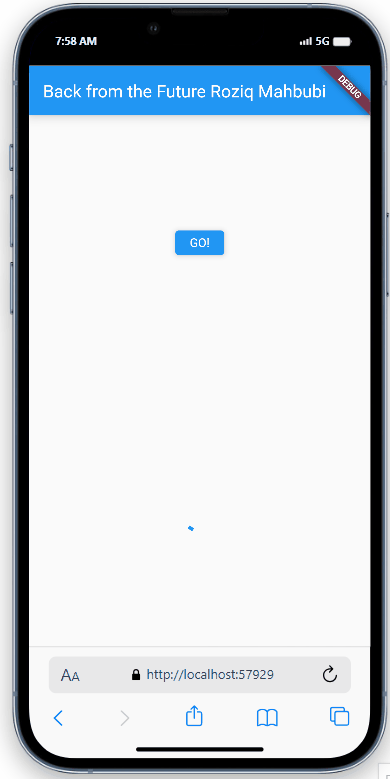
 
#### Soal 7
Capture hasil praktikum Anda berupa GIF dan lampirkan di README. Lalu lakukan commit dengan pesan "W12: Soal 7".
##### Jawaban :

 
#### Soal 8
Jelaskan maksud perbedaan kode langkah 1 dan 4!
##### Jawaban :
1. Perbedaan langkah 1 dan 4 adalah pada pengimplementasian grouping future. Di mana pada langkah 1 digunakan tipe data ```FutureGroup```, yang mana dibutuhkan penambahan Future secara satu persatu dan diperlukan untuk di-close agar ```Futuregroup``` dapat dijalankan. Sedangkan pada langkah 4 dilakukan grouping dengan menggunakan list pada ```Future.wait()``` yang akan langsung diselesaikan dengan function ```.wait()```, sehingga semua Future yang ingin diselesaikan secara bersamaan harus didefinisikan di dalam list, jika tidak, maka Future tidak akan bisa diselesaikan secara bersamaan.
2. output : <br> 
 
#### Soal 9
Capture hasil praktikum Anda berupa GIF dan lampirkan di README. Lalu lakukan commit dengan pesan "W12: Soal 9".
##### Jawaban :
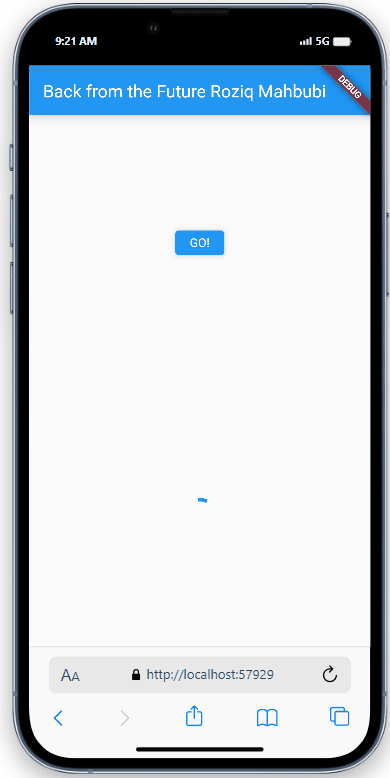 <br>
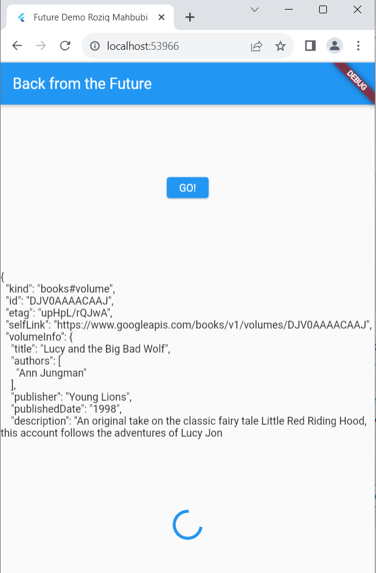
 
#### Soal 10
Panggil method handleError() tersebut di ElevatedButton, lalu run. Apa hasilnya? Jelaskan perbedaan kode langkah 1 dan 4!
##### Jawaban :
1. Pada langkah 1, method ```returnError``` hanya digunakan untuk melakukan ```throw exception``` dan error handling dilakukan di ```onPressed()``` pada ```elevatedButton```, sedangkan pada langkah 4, error handling dilakukan pada function ```handleError()```.
2. output : <br> 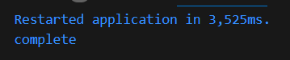 <br> 
 
#### Soal 11
Tambahkan nama panggilan Anda pada tiap properti title sebagai identitas pekerjaan Anda.
##### Jawaban :
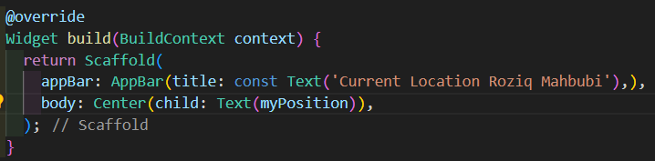
 
#### Soal 12
* Jika Anda tidak melihat animasi loading tampil, kemungkinan itu berjalan sangat cepat. Tambahkan delay pada method getPosition() dengan kode await Future.delayed(const Duration(seconds: 3));
* Apakah Anda mendapatkan koordinat GPS ketika run di browser? Mengapa demikian?
* Capture hasil praktikum Anda berupa GIF dan lampirkan di README. Lalu lakukan commit dengan pesan "W12: Soal 12".
##### Jawaban :
1. kode : <br >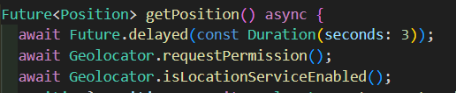
2. jika aplikasi dijalankan menggunakan emulator browser, maka akan tetap mendapatkan koordinat lokasi <br> emulator browser : <br> 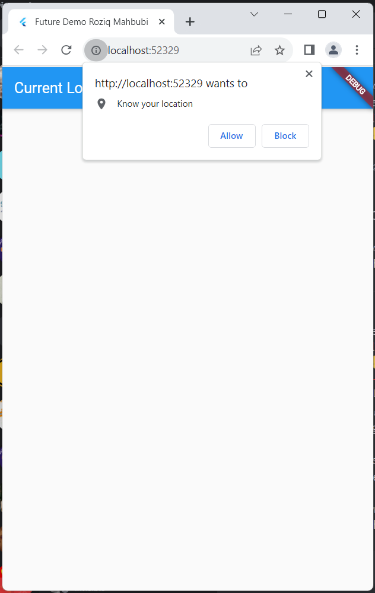 <br> 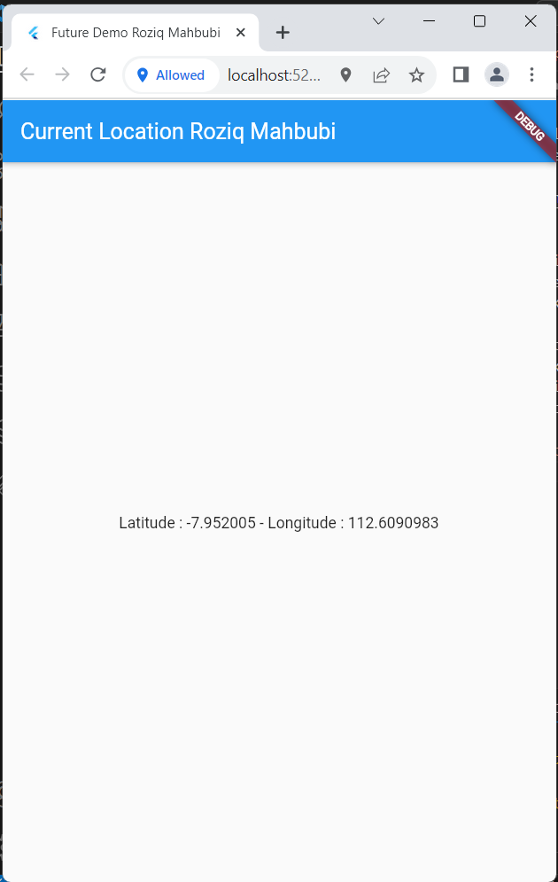
3. emulator AndroidStudio : <br> 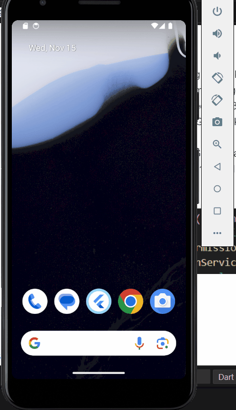 <br> emulator smartphone : <br> 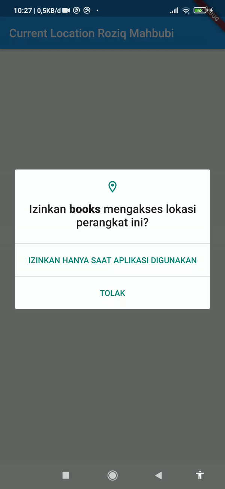
4. Kesimpulan : pengaksesan lokasi menggunakan emulator browser dan emulator smartphone akan mendapatkan informasi lokasi sebenarnya dari device, sebaliknya emulator AndroidStudio akan mengembalikan informasi lokasi yang salah.
 
#### Soal 13
* Apakah ada perbedaan UI dengan praktikum sebelumnya? Mengapa demikian?
* Capture hasil praktikum Anda berupa GIF dan lampirkan di README. Lalu lakukan commit dengan pesan "W12: Soal 13".
##### Jawaban :
1. Ya, output visual aplikasi berubah menjadi animasi progress indicator ketika informasi location belum diselesaikan. Hal ini terjadi karena variable position yang menyimpan informasi lokasi device dinaikkan pada hierarki tree menjadi child dari state, dan nilainya didapatkan menggunakan function getPosition pada initState() dan pada method build digunakan pemilihan kondisi yang menampilkan output visual sesuai value position di dalam widget FutureBuilder yang berkemungkinan memiliki Listener untuk object Future sehingga dapat melakukan update tampilan ketika terjadi perubahan value sebuah Future.
2. output : <br> 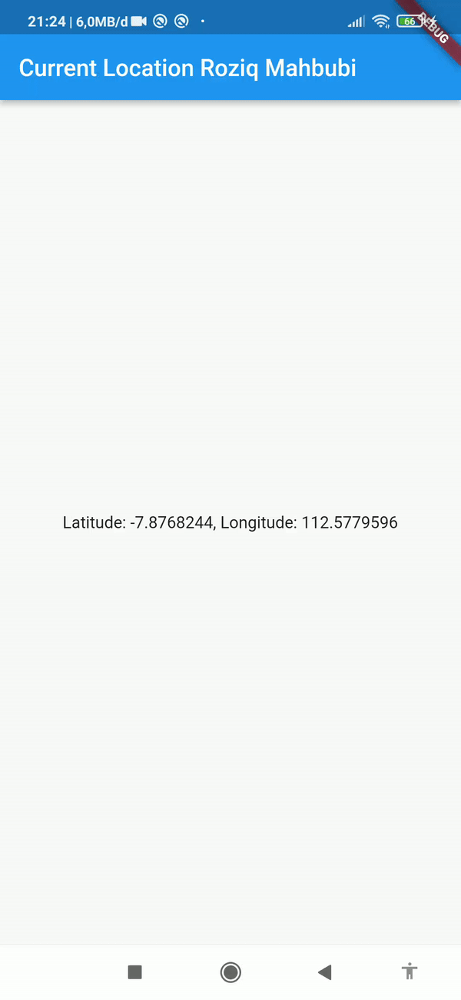
 
#### Soal 
##### Jawaban :
 
#### Soal 
##### Jawaban :
 
#### Soal 
##### Jawaban :
 
#### Soal 
##### Jawaban :
 