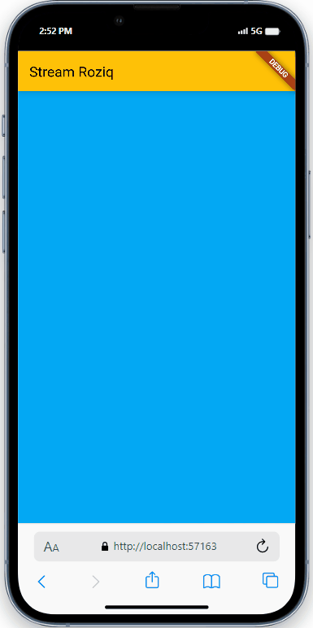
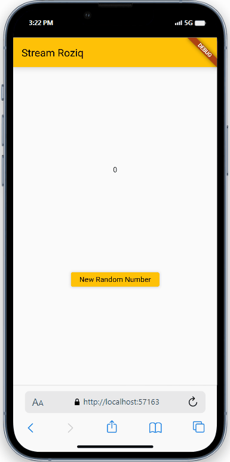
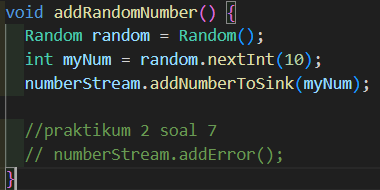
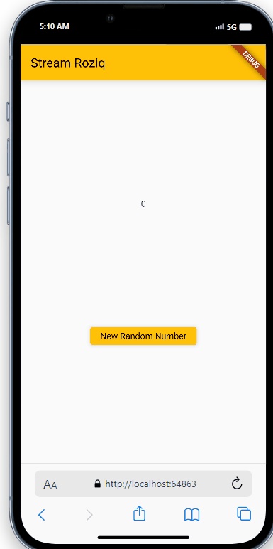
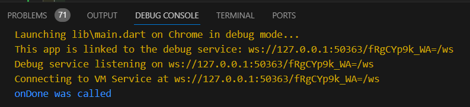
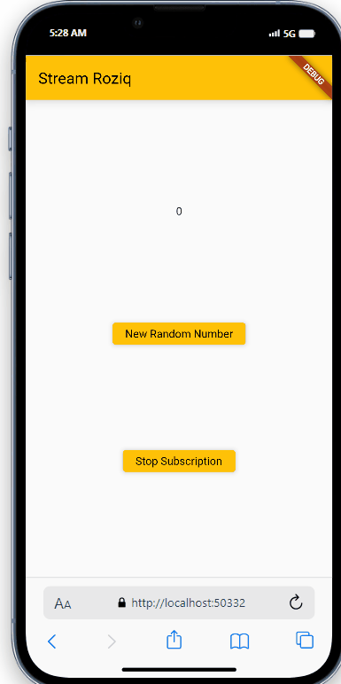

# Pemrograman Mobile - Pertemuan 13
```
Nama        : Roziq Mahbubi
NIM         : 2141720086
```

## Praktikum

#### Soal 1
 * Tambahkan nama panggilan Anda pada title app sebagai identitas hasil pekerjaan Anda.
 * Gantilah warna tema aplikasi sesuai kesukaan Anda.
 * Lakukan commit hasil jawaban Soal 1 dengan pesan "W13: Jawaban Soal 1"
##### Jawaban :
1. 
2. 
 
#### Soal 2
 * Tambahkan 5 warna lainnya sesuai keinginan Anda pada variabel colors tersebut.
 * Lakukan commit hasil jawaban Soal 2 dengan pesan "W13: Jawaban Soal 2"
##### Jawaban :
 1. 

#### Soal 3
* Jelaskan fungsi keyword yield* pada kode tersebut!
* Apa maksud isi perintah kode tersebut?
* Lakukan commit hasil jawaban Soal 3 dengan pesan "W13: Jawaban Soal 3"
##### Jawaban :
1. Keyword yield* dimaksudkan untuk mengeluarkan nilai saat ini dari sebuah stream melalui sebuah generator, dalam praktikum ini generator yang digunakan adalah Stream.periodic()
2. Pada kode tersebut, ditambahkan function ```getColor``` yan bertipe data ```Stream<Color>```, di dalam function tersebut terdapat kata kunci ```yield*```, di mana kata kunci ini digunakan untuk mengembalikan nilai dari Stream secara terus menerus, kemudian terdapat penggunaan generator ```Stream.periodic()``` yang digunakan untuk mengembalikan nilai dari stream secara periodik, dalam kode tersebut pengembalian dilakukan tiap 1 detik dan pengembalian data dilakukan secara berulang mengikuti iterasi, mulai dari indeks 0-9 kemudian kembali lagi ke indeks 0 dan begitu seterusnya.
 
#### Soal 4
* Capture hasil praktikum Anda berupa GIF dan lampirkan di README.
* Lakukan commit hasil jawaban Soal 4 dengan pesan "W13: Jawaban Soal 4"
##### Jawaban :

 
#### Soal 5
* Jelaskan perbedaan menggunakan listen dan await for (langkah 9) !
* Lakukan commit hasil jawaban Soal 5 dengan pesan "W13: Jawaban Soal 5"
##### Jawaban :
1. penggunaan await for() akan menghentikan sementara flow aplikasi hingga proses dari Stream telah selesai, sementara pada listen flow aplikasi tidak terhenti untuk menunggu selesainya proses Stream.
 
#### Soal 6
* Jelaskan maksud kode langkah 8 dan 10 tersebut!
* Capture hasil praktikum Anda berupa GIF dan lampirkan di README.
* Lalu lakukan commit dengan pesan "W13: Jawaban Soal 6".
##### Jawaban :
1. 
   1. langkah 8 :
    pada langkah 8 dilakukan modifikasi pada ``initState()``, di mana dilakukan instansiasi ``numberStream``, inisiasi ``numberStreamController``, deklarasi stream baru yang merupakan stream numberStream yang dimulai menggunakan ``numberStreamController.stream()``, dan juga pembuatan listener untuk stream tersebut yang memiliki ``setState`` yang merubah nilai ``lastNumber`` menjadi nilai terbaru dari stream tersebut.
   2. langkah 10 :
    pada langkah 10 ditambahkan function baru yang melakukan penambahan data angka baru yang didapatkan dari random pada ``sink`` dari ``numberStream``
2. output : <br> 
 
#### Soal 7
* Jelaskan maksud kode langkah 13 sampai 15 tersebut!
* Kembalikan kode seperti semula pada Langkah 15, comment addError() agar Anda dapat melanjutkan ke praktikum 3 berikutnya.
* Lalu lakukan commit dengan pesan "W13: Jawaban Soal 7".
##### Jawaban :
1. pada langkah 13 dilakukan penambahan function addError() untuk menambahkan status error pada proses Stream. Pada langlah 14 dilakukan penambahan error handling pada listener stream, yang akan merubah nilai lastNumber menjadi -1 jika terjadi error. Dan pada langkah 15 dilakukan perubahan pada function addRandomNumber() sehingga function tersebut akan menambahkan status error pada Stream daripada menambahkan data baru pada sink milik Stream.
2. 
3. output : <br> 
 
#### Soal 8
* Jelaskan maksud kode langkah 1-3 tersebut!
* Capture hasil praktikum Anda berupa GIF dan lampirkan di README.
* Lalu lakukan commit dengan pesan "W13: Jawaban Soal 8".

##### Jawaban :
1. Pada langkah 1-3, dilakukan penambahan transformer dan penggantian listener untuk melewati transformer terlebih dahulu. Transformer stream digunakan untuk memanipulasi data yang akan dimasukkan ke dalam sink milik stream.
2. output : <br> 
 
#### Soal 9
* Jelaskan maksud kode langkah 2, 6 dan 8 tersebut!
* Capture hasil praktikum Anda berupa GIF dan lampirkan di README.
* Lalu lakukan commit dengan pesan "W13: Jawaban Soal 9". 

##### Jawaban :
1. Pada langkah 2 dilakukan perubahan listener menjadi variable subscription. Pada langkah 6 dilakukan penutupan subscription pada methos ``dispose()``. Pada langkah 8 dilakukan perubahan pada methos ``addRandomNumber()`` dengan menambahkan pemilihan kondisi jika subscription belum ditutup dan sudah ditutup.
2. output : <br>  <br> 
 
#### Soal 

##### Jawaban :
 
#### Soal 

##### Jawaban :
 
#### Soal 

##### Jawaban :
 
#### Soal 

##### Jawaban :
 