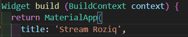
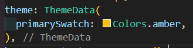
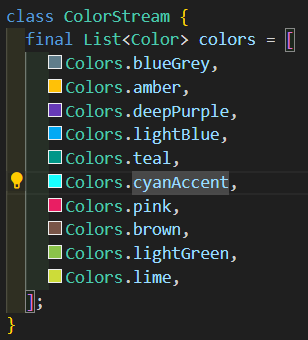

# Pemrograman Mobile - Pertemuan 13
```
Nama        : Roziq Mahbubi
NIM         : 2141720086
```

## Praktikum

#### Soal 1
 * Tambahkan nama panggilan Anda pada title app sebagai identitas hasil pekerjaan Anda.
 * Gantilah warna tema aplikasi sesuai kesukaan Anda.
 * Lakukan commit hasil jawaban Soal 1 dengan pesan "W13: Jawaban Soal 1"
##### Jawaban :
1. 
2. 
 
#### Soal 2
 * Tambahkan 5 warna lainnya sesuai keinginan Anda pada variabel colors tersebut.
 * Lakukan commit hasil jawaban Soal 2 dengan pesan "W13: Jawaban Soal 2"
##### Jawaban :
 1. 
#### Soal 

##### Jawaban :
 
#### Soal 

##### Jawaban :
 
#### Soal 

##### Jawaban :
 
#### Soal 

##### Jawaban :
 
#### Soal 

##### Jawaban :
 
#### Soal 

##### Jawaban :
 
#### Soal 

##### Jawaban :
 
#### Soal 

##### Jawaban :
 
#### Soal 

##### Jawaban :
 
#### Soal 

##### Jawaban :
 
#### Soal 

##### Jawaban :
 