# Pemrograman Mobile - Pertemuan 4
```
Nama            : Roziq Mahbubi
NIM             : 2141720086
```
## Praktikum
#### Praktikum 1
##### Langkah 1
output : 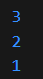

##### Langkah 3
output : 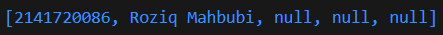

#### Praktikum 2
##### Langkah 1
output : 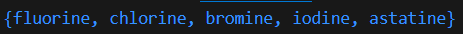

##### Langkah 3
output sebelum diubah : 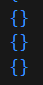
output setelah diubah : 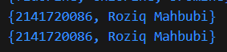

#### Praktikum 3
##### Langkah 1
output : 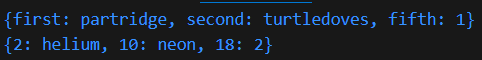

##### Langkah 3
pada kode yang diberikan pada langkah ini, muncul peringatan karena adanya deklarasi list baru bernama mhs1 dan mhs2, namun hingga akhir kode kedua list tersebut tidak pernah digunakan, sehingga dianggap membebani memory.
<br>

kode : 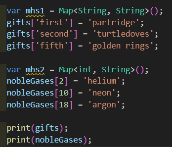
output : 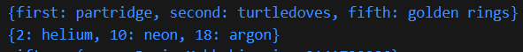

##### Manambahkan data
output : 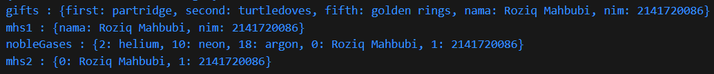

### Praktikum 4
#### Langkah 1
Pada langkah ini, terdapat error pada kode yang diberikan karena kesalahan pada nama variable <i>list</i> yang ada pada saat pemanggilan.
<br>

kode : 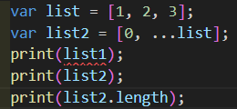
output : 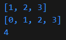

#### Langkah 3
Pada langkah ini, terjadi error karena dilakukan inisialisasi list baru tanpa deklarasi. Koreksi dari kode ini adalah menambahkan keyword <i>var</i> sebelum nama list baru.
<br>

kode : 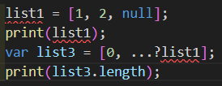
output : 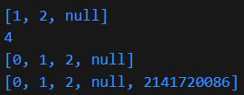

#### Langkah 4
Kode pada langkah ini error karena variable yang digunakan sebagai pemilihan kondisi belum dideklarasikan. Solusinya adalah mendeklarasikan variable tersebut dan juga menginisialisasikan nilainya.
<br>

kode : 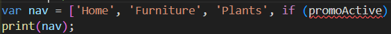
output jika promoActive true : 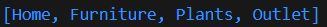
output jika promoActive false : 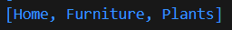

#### Langkah 5
Kode pada langkah ini error karena variable yang digunakan sebagai pemilihan kondisi belum dideklarasikan. Solusinya adalah mendeklarasikan variable tersebut dan juga menginisialisasikan nilainya.
<br>

kode : 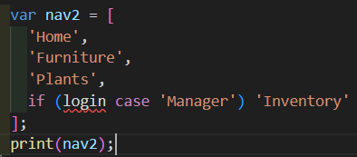
output jika login == 'Manager' : 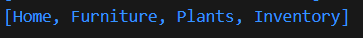
output jika login != 'Manager' : 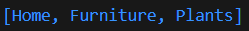

#### Langkah 6
Pada langkah ini, digunakan operator collection for dalam sebuah list. Pada kode kali ini, operator for diguanakan untuk melakukan pengulangan dengan iterasi sesuai dengan jumlah isi dari list <i>listOfInts</i>, lalu menempatkan tiap isi list tersebut ke dalam sebuah string yang akan dijadikan isi dari list lainnya.
<br>

output : 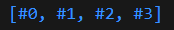

### Praktikum 5
#### Langkah 1
Pada langkah ini terjadi error karena hilangnya semicolon.
<br>

kode : 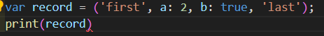
output : 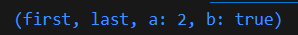

#### Langkah 3
Pada langkah ini tidak terjadi error, hanya saja function tukar() tidak digunakan, sehingga tidak terlihat output yang berbeda. Solusinya adalah dengan menggunakan funstion tukar().
<br>

ouput : 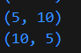

#### Langkah 4
Pada langkah ini, terjadi error karena record mahasiswa belum diinisialisasikan namun sudah diakses. Hal itu terjadi karena record mahasiswa bukanlah nullable variable sehingga sistem mendeteksinya sebagai error. Solusinya adalah melakukan inisialisasi value dari record mahasiswa.
<br>

kode : 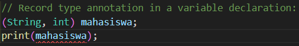
output : 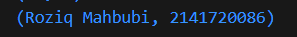

#### Langkah 5
Collection record pada dart, merupakan tipe data yang immutable, yang berarti tipe data record merupakan tipe data yang valuenya tidak bisa diubah setelah diinisialisasikan pertama kali, sehingga perubahan value hanya bisa dilakukan saat inisialisasi pertama kali.
<br>

output sebelum diubah : 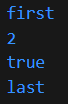
output setelah diubah : 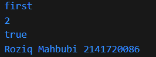

## Tugas