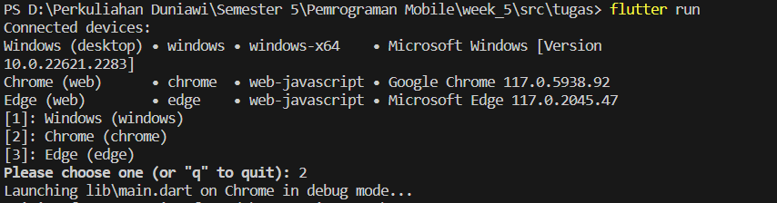
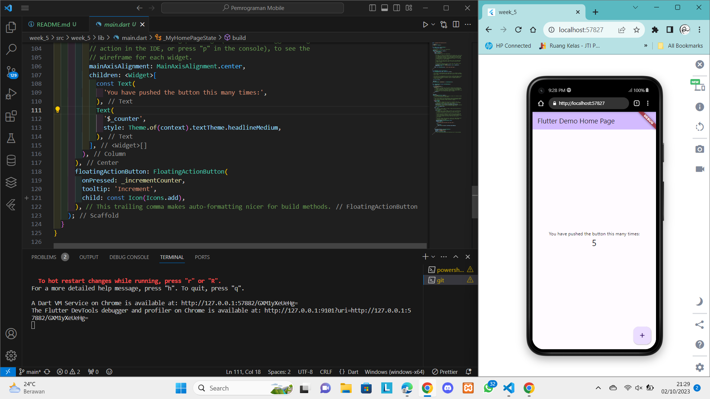
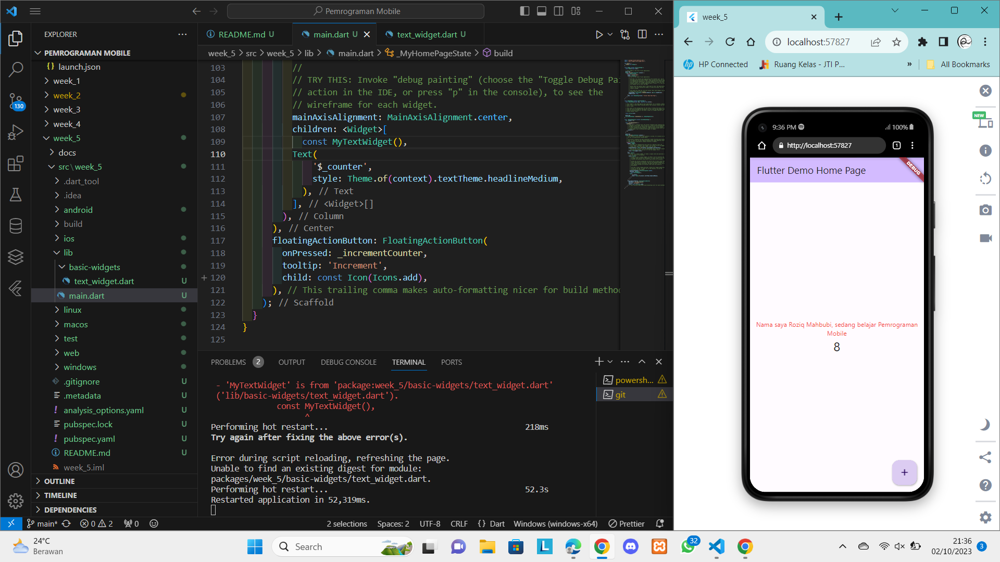
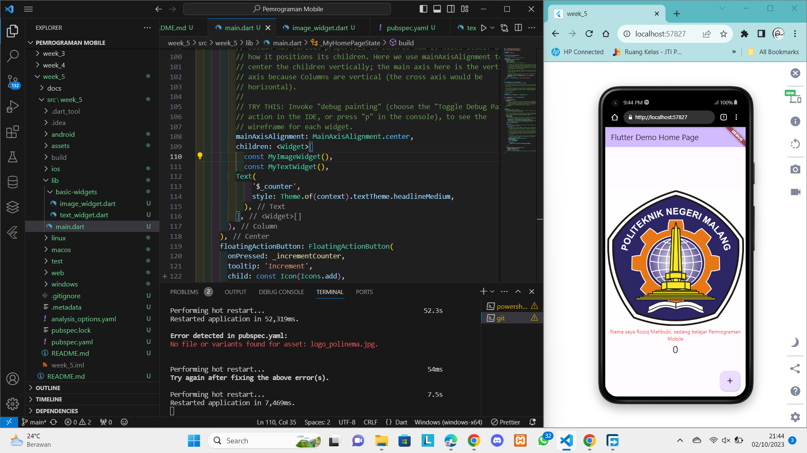
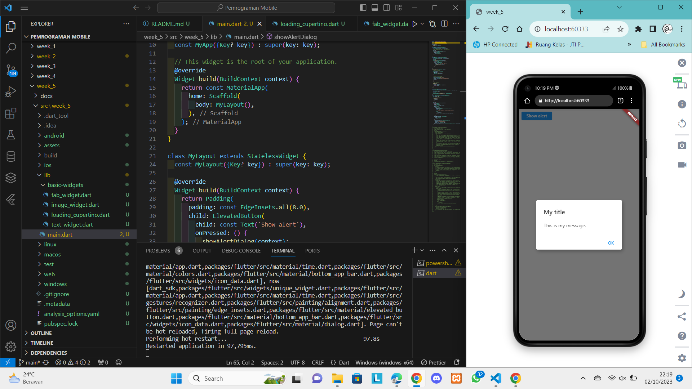
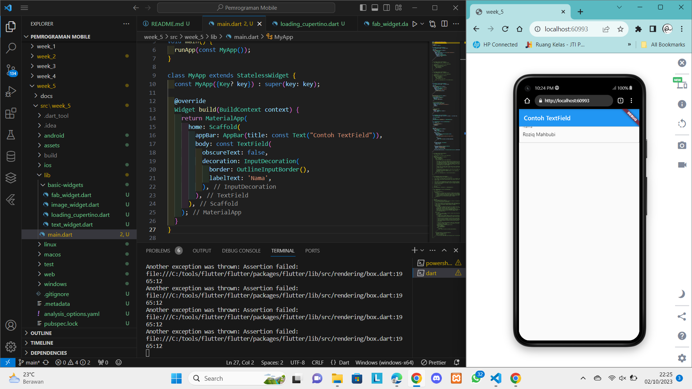
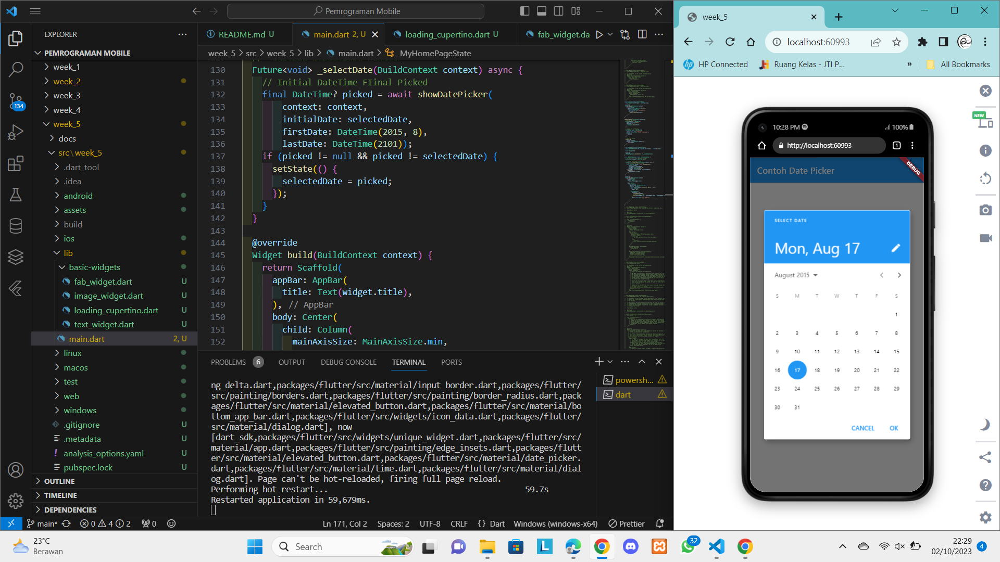
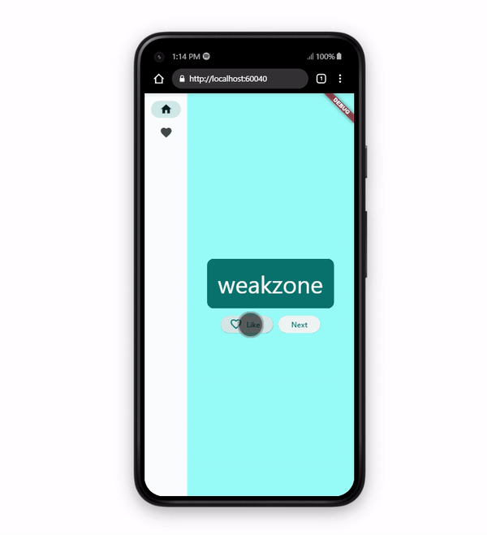

# Pemrograman Mobile - Pertemuan 5
```
Nama            : Roziq Mahbubi
NIM             : 2141720086
```

### Langkah Praktikum : 

1. Membuat Project, membuat project flutter pada command prompt dapat dilakukan dengan perintah : 'flutter create nama_project'
2. Mencoba Menjalankan Project


3. Membuat Text Widget

4. Membuat Image Widget

5. Membuat Dialog Widget

6. Membuat Text Input Widget

7. Membuat Date Selection Widget


### Hasil Tugas Praktikum :

