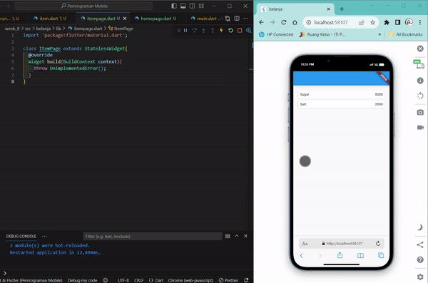
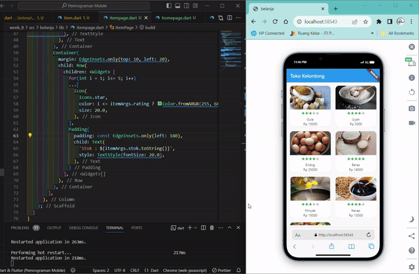

# Pemrograman Mobile - Pertemuan 8
```
Nama            : Roziq Mahbubi
NIM             : 2141720086
```

## Praktikum
<p> Pada hasil akhir praktikum, terjadi error pada saat menekan tombol tiap produk karena pada halaman ItemPage belum dilakukan return widget apapun di dalam function buildnya.</p>



## Tugas
<p>Pada tugas, dilakukan :</p>
1. Perubahan pada halaman HomePage pada bagian listview tiap item, dirubah menjadi gridview.
2. Menambahkan image, rating dan stock pada Item.
3. Melakukan design halaman ItemPage untuk menampilkan informasi seputar Item.
4. Mengimplementasikan widget Hero pada gambar Item.

